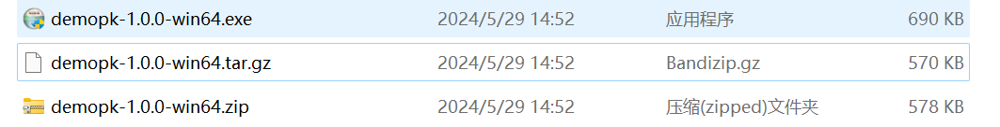

cmake pack 
用于将我们的写好的项目 打包，发送给使用方；打包后产生的内容有

1. 源代码包

2. 二进制包

3. 平台原生的二进制安装

   - Debian  -> .deb

   - red hat -> .rpm
   - macOS   -> .dmg

   - windows -> NSIS





## cmake 与 cpack


与CMake一样，CPack也有生成器的概念。

CMake上下文中的生成器是用于生成本地构建脚本的工具，例如Unix Makefile或Visual Studio项目文件，

CPack上下文中的生成器是用于打包的工具。

为源包和二进制包定义了 CPACK_SOURCE_GENERATOR 和 CPACK_GENERATOR变量


cpack 和 cmake 的变量是分离开的，CPACK变量通常以 CPACK__xxx开头

get_cmake_property(res VARIABLE) 获得 CMAKE 定义的变量


## 基本设置

```cmake
# 设置安装的 project 适用于复杂的项目
SET(CPACK_INSTALL_CMAKE_PROJECTS "SubProject;MySub;ALL;/")


# NSIS windows etc ...

# 设置忽略的文件
set(CPACK_SOURCE_IGNORE_FILES "${PROJECT_BINARY_DIR};/.git/;.gitignore")


# 设置默认安装路径

set (CPACK_PACKAGE_INSTALL_DIRECTORY "CMake
${CMake_VERSION_MAJOR}.${CMake_VERSION_MINOR}")

CPACK_PACKAGE_VENDOR #发行商

# 设置安装名
set (CPACK_NSIS_PACKAGE_NAME "CMake
${CMake_VERSION_MAJOR}.${CMake_VERSION_MINOR}")

# 设置图标
set (CPACK_NSIS_MUI_ICON
"${CMake_SOURCE_DIR}/Utilities/Release\\CMakeLogo.ico")

set (CPACK_NSIS_MUI_UNIICON
     "${CMake_SOURCE_DIR}/Utilities/Release\\CMakeLogo.ico")

# 图标
set (CPACK_PACKAGE_ICON
"${CMake_SOURCE_DIR}/Utilities/Release\\CMakeInstall.bmp")

# 创建桌面图标
set (CPACK_CREATE_DESKTOP_LINKS cmake-gui)

# 创建多个图标 到启动菜单 start menu 当安装超过多个可执行文件时

set (CPACK_PACKAGE_EXECUTABLES "cmake-gui" "CMake" ) # cmake-gui 原始名称 CMake 在 start menu 显示的名称

set (CPACK_NSIS_MENU_LINKS
"doc/cmake-${VERSION_MAJOR}.${VERSION_MINOR}/cmake-gui.html"
"cmake-gui Help" "http://www.cmake.org" "CMake Web Site")

# 设置安装目录
set (CPACK_PACKAGE_INSTALL_DIRECTORY "CMake
${CMake_VERSION_MAJOR}.${CMake_VERSION_MINOR}")


# 权利声明
set (CPACK_RESOURCE_FILE_LICENSE
"${CMAKE_CURRENT_SOURCE_DIR}/Copyright.txt")

# 添加环境变量

set(CPACK_NSIS_MODIFY_PATH true) # option提供选项 添加到 path 环境变量 default off
```


```cmake
CPACK_PROJECT_CONFIG_FILE #配置文件

configure_file ("${PROJECT_SOURCE_DIR}/MyCPackOptions.cmake.in" # 额外的配置文件
                "${PROJECT_BINARY_DIR}/MyCPackOptions.cmake"
@ONLY)


# NSIS 设置注册表
# NSIS.template.in
```


### 安装微软运行时库

```cmake
include (InstallRequiredSystemLibraries)

# 默认放置到 bin , 通过下面可以修改
set (CMAKE_INSTALL_SYSTEM_RUNTIME_LIBS_SKIP TRUE) # 关闭默认安装
include (InstallRequiredSystemLibraries)
install (PROGRAMS ${CMAKE_INSTALL_SYSTEM_RUNTIME_LIBS}
DESTINATION mydir)

set(CMAKE_INSTALL_DEBUG_LIBRARIES true) # 可安装debug 版本库
```


## componet 组件化安装

对于复杂的软件，通常有很多部分，可以提供一种组件化安装的方式

```cmake
cmake_minimum_required(VERSION 3.20 FATAL_ERROR)
project(MyLib)

add_library(mylib mylib.cpp)

add_executable(mylibapp mylibapp.cpp)
target_link_libraries(mylibapp mylib)

install(TARGETS mylib ARCHIVE DESTINATION lib)
install(TARGETS mylibapp RUNTIME DESTINATION bin)
install(FILES mylib.h DESTINATION include)

# add CPack to project
set(CPACK_PACKAGE_NAME "MyLib")
set(CPACK_PACKAGE_VENDOR "CMake.org")
set(CPACK_PACKAGE_DESCRIPTION_SUMMARY
    "MyLib - CPack Component Installation Example")
set(CPACK_PACKAGE_VERSION "1.0.0")
set(CPACK_PACKAGE_VERSION_MAJOR "1")
set(CPACK_PACKAGE_VERSION_MINOR "0")
set(CPACK_PACKAGE_VERSION_PATCH "0")
set(CPACK_PACKAGE_INSTALL_DIRECTORY "CPack Component Example")


include(CPack)
```


```cmake
install(TARGETS mylib
ARCHIVE
DESTINATION lib
COMPONENT libraries)

install(TARGETS mylibapp
RUNTIME
DESTINATION bin
COMPONENT applications)

install(FILES mylib.h
DESTINATION include
COMPONENT headers)

```


### cpack_add_install_type

```cmake
cpack_add_install_type(typename
                       [DISPLAY_NAME name])
```

设置安装类型

- Full
- Developer


### cpack_add_component_group

设置component 组

```cmake
cpack_add_component_group(groupname
                         [DISPLAY_NAME name]
                         [DESCRIPTION description]
                         [PARENT_GROUP parent]
                         [EXPANDED]
                         [BOLD_TITLE])
```


```cmake
cpack_add_component_group(Development
EXPANDED
DESCRIPTION
"All of the tools you'll ever need to develop software")
```


### cpack_add_component

前面两项都是为了这个命令做准备

```cmake
cpack_add_component(compname
                    [DISPLAY_NAME name]
                    [DESCRIPTION description]
                    [HIDDEN | REQUIRED | DISABLED ]
                    [GROUP group]
                    [DEPENDS comp1 comp2 ... ]
                    [INSTALL_TYPES type1 type2 ... ]
                    [DOWNLOADED]
                    [ARCHIVE_FILE filename]
                    [PLIST filename])
```

- DISPLAY_NAME 别名
- DESCRIPTION 描述
- GROUP 组
- DEPENDS 依赖
- INSTALL_TYPES 安装类型


```cmake
cpack_add_component(applications)
cpack_add_component(libraries)
cpack_add_component(headers)

# 设置别名
cpack_add_component(applications DISPLAY_NAME "MyLib Application")
cpack_add_component(libraries DISPLAY_NAME "Libraries")
cpack_add_component(headers DISPLAY_NAME "C++ Headers")

#设置描述
cpack_add_component(applications DISPLAY_NAME "MyLib Application"
DESCRIPTION
"An extremely useful application that makes use of MyLib"
)
cpack_add_component(libraries DISPLAY_NAME "Libraries"
DESCRIPTION
"Static libraries used to build programs with MyLib"
)

cpack_add_component(headers DISPLAY_NAME "C++ Headers"
DESCRIPTION "C/C++ header files for use with MyLib"
)
```


设置组件依赖 防止不可用【如果依赖项不存在 就无法安装】

```cmake
cpack_add_component(headers DISPLAY_NAME "C++ Headers"
DESCRIPTION
"C/C++ header files for use with MyLib"
DEPENDS libraries
)
```


```cmake
cpack_add_component(applications
DISPLAY_NAME "MyLib Application"
DESCRIPTION
"An extremely useful application that makes use of MyLib"
GROUP Runtime)

cpack_add_component(libraries
DISPLAY_NAME "Libraries"
DESCRIPTION
"Static libraries used to build programs with MyLib"
GROUP Development)

cpack_add_component(headers
DISPLAY_NAME "C++ Headers"
DESCRIPTION "C/C++ header files for use with MyLib"
GROUP Development
DEPENDS libraries
)
```


```cmake
cpack_add_component(libraries DISPLAY_NAME "Libraries"
DESCRIPTION
"Static libraries used to build programs with MyLib"
GROUP Development
INSTALL_TYPES Developer Full)

cpack_add_component(applications
DISPLAY_NAME "MyLib Application"
DESCRIPTION
"An extremely useful application that makes use of MyLib"
GROUP Runtime
INSTALL_TYPES Full)

cpack_add_component(headers
DISPLAY_NAME "C++ Headers"
DESCRIPTION "C/C++ header files for use with MyLib"
GROUP Development
DEPENDS libraries)
```


## 其他进阶变量

```cmake
CPACK_COMPONENTS_ALL
CPACK_INSTALL_CMAKE_PROJECTS
CPACK_SYSTEM_NAME
CPACK_PACKAGE_VERSION
CPACK_TOPLEVEL_TAG
CPACK_INSTALL_COMMANDS
CPACK_INSTALL_SCRIPTS
CPACK_PRE_BUILD_SCRIPTS
CPACK_POST_BUILD_SCRIPTS
CPACK_PACKAGE_FILES
CPACK_INSTALLED_DIRECTORIES
CPACK_PACKAGE_INSTALL_REGISTRY_KEY
CPACK_CREATE_DESKTOP_LINKS
CPACK_BINARY_<GENNAME>
CPACK_READELF_EXECUTABLE
CPACK_OBJCOPY_EXECUTABLE
CPACK_OBJDUMP_EXECUTABLE
```


## 其他安装器

linux-like environment for windows

- cygwin 

Mac OS X

- Drag and Drop
- PackageMaker
- X11 

for debian

for rpm


> cpack --help


## 参考

> 多看文档

[CPack — CMake 3.29.3 Documentation](https://cmake.org/cmake/help/latest/module/CPack.html)

[Packaging With CPack — Mastering CMake](https://cmake.org/cmake/help/book/mastering-cmake/chapter/Packaging With CPack.html)

[CPackComponent — CMake 3.29.3 Documentation](https://cmake.org/cmake/help/latest/module/CPackComponent.html)

[InstallRequiredSystemLibraries](https://cmake.org/cmake/help/latest/module/InstallRequiredSystemLibraries.html)
